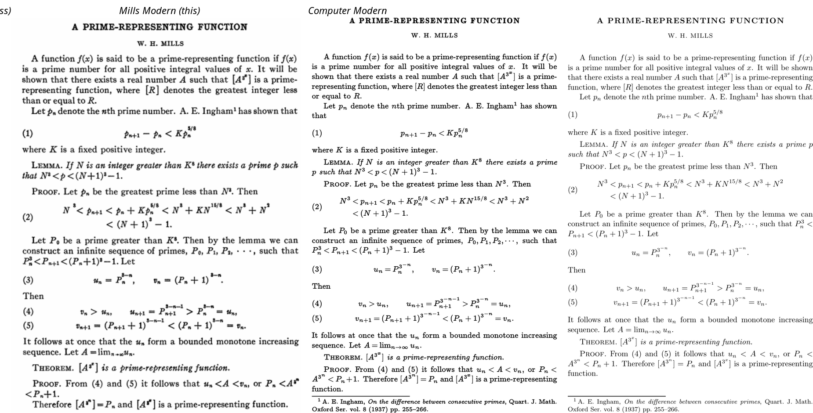

# Mills Modern

Computer Modern, regenerated from Knuth's own METAFONT sources with
letterpress-style parameters. The result imitates the look of AMS journals set
in Monotype Modern 8A in the 1940s–60s. Knuth based Computer Modern on that
same Monotype Modern, so the only change needed is to put back what the press
did to the type.

## How it works

`mf/mmbase.mf` hooks CM's `generate` macro. Each `mf/mmXX.mf` inputs it and
then Knuth's unmodified `cmXX.mf`, so all of CM's parameters, glyph programs,
metrics, kerning and math fitting stay intact. Before the driver runs, the
hook applies these adjustments:

| knob | default | effect |
|---|---|---|
| `mm_ink#` | 9/36 pt | added to every stem, curve, bulb and dot (ink spread) |
| `mm_hair#` | 4/36 pt | extra gain on hairlines, bars and serifs (lower contrast) |
| `mm_round#` | 4/36 pt | rounder corners (`crisp`, `tiny`, `fine`) |
| `mm_wide` | 1.04 | wider set width |

The gain is a fixed amount in true points, the same at every design size, just
like real ink spread. That makes the 5–7 pt fonts relatively heavier, which
matches the sturdy superscripts of the period. `millsmodern.sty` also uses
larger script sizes (10/7/6) and tighter relation spacing, imitating hand-set
math.

## Build

Requires TeX Live (`mf`, `pdflatex`), `mftrace`, `potrace` and `t1utils`.

    ./build.sh type1   # 47 fonts traced to Type 1 outlines (~2.5 min)
    ./render.sh type1  # out/mills.pdf, plus out/mills-cm.pdf for comparison

`./build.sh pk && ./render.sh pk` builds 1200 dpi bitmaps in a few seconds,
which is handy while tuning the knobs in `mf/mmbase.mf`.

Using the fonts in your own document: put `tex/` on `TEXINPUTS`, `build/tfm`
on `TFMFONTS` and `build/type1` on `T1FONTS`/`TEXFONTMAPS`, add
`\pdfmapfile{+millsmodern.map}`, and use `\usepackage{millsmodern}`.

## Limits

- Glyph *shapes* are still CM's. Monotype's math italic (*p*, *n*, *u*, *v*)
  and the bold title caps are drawn differently, so changing parameters
  can't reproduce them.
- OT1 encoding only (CM's 128-glyph fonts). There are no accented glyphs
  for T1.
