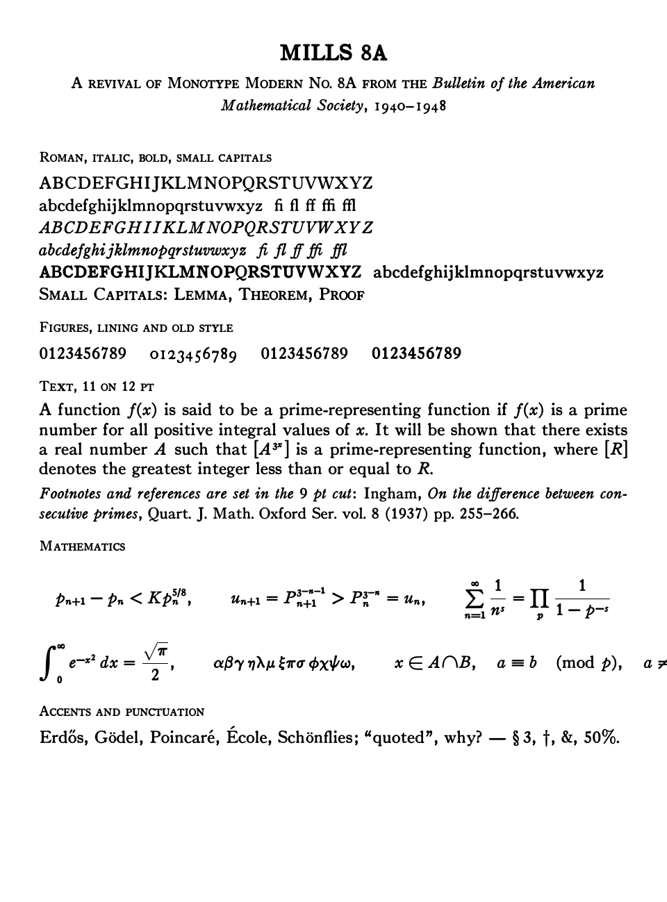
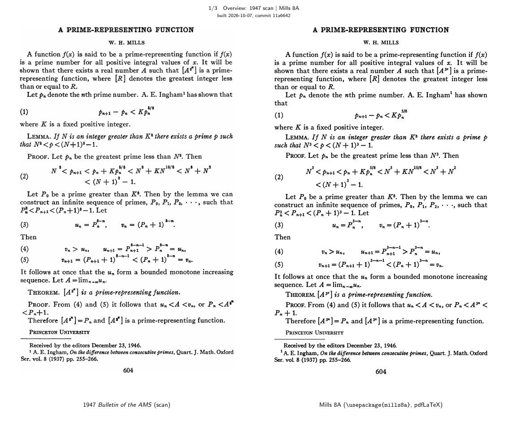
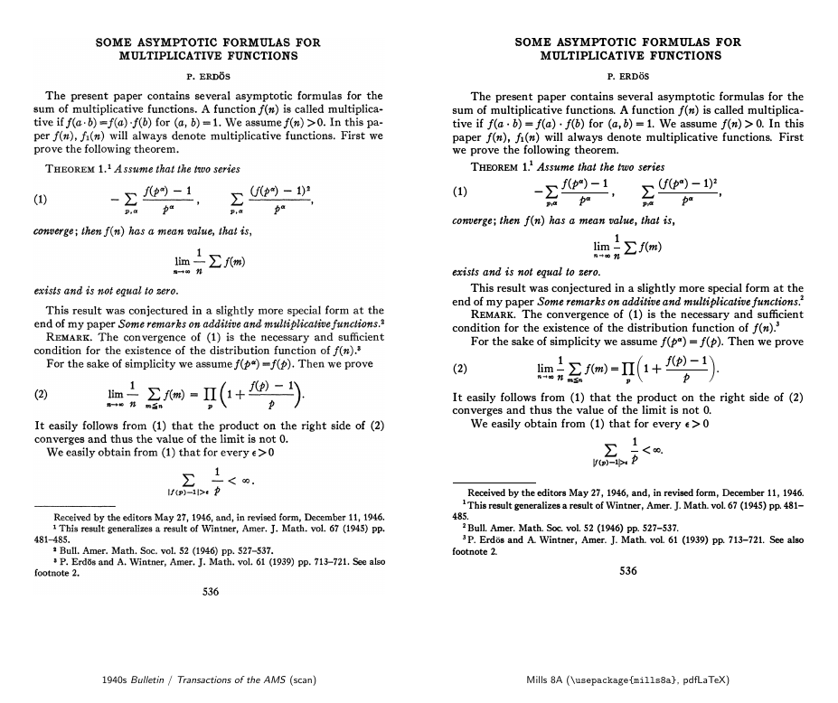
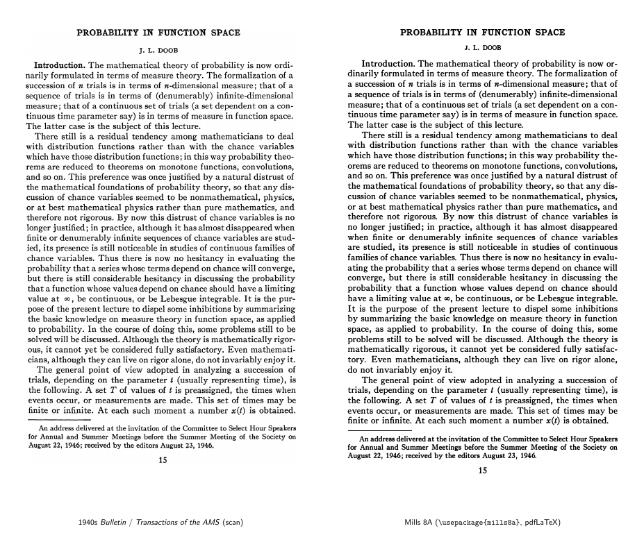
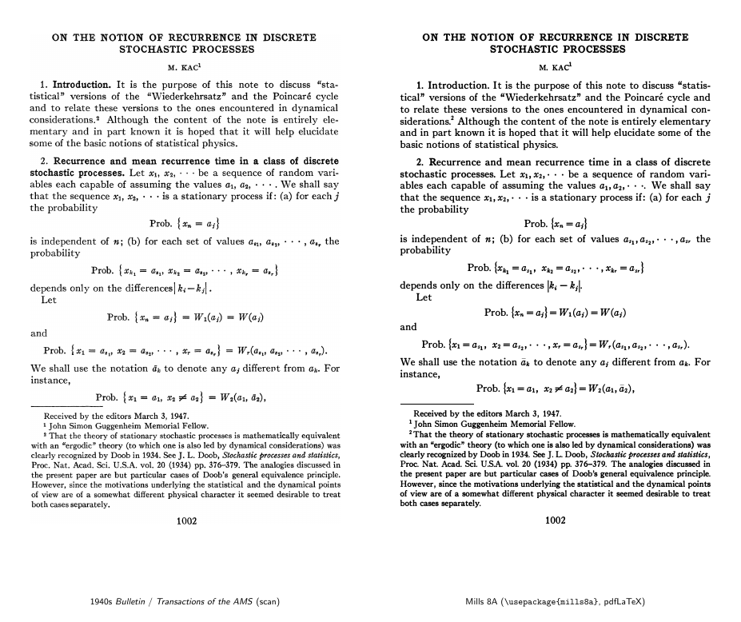
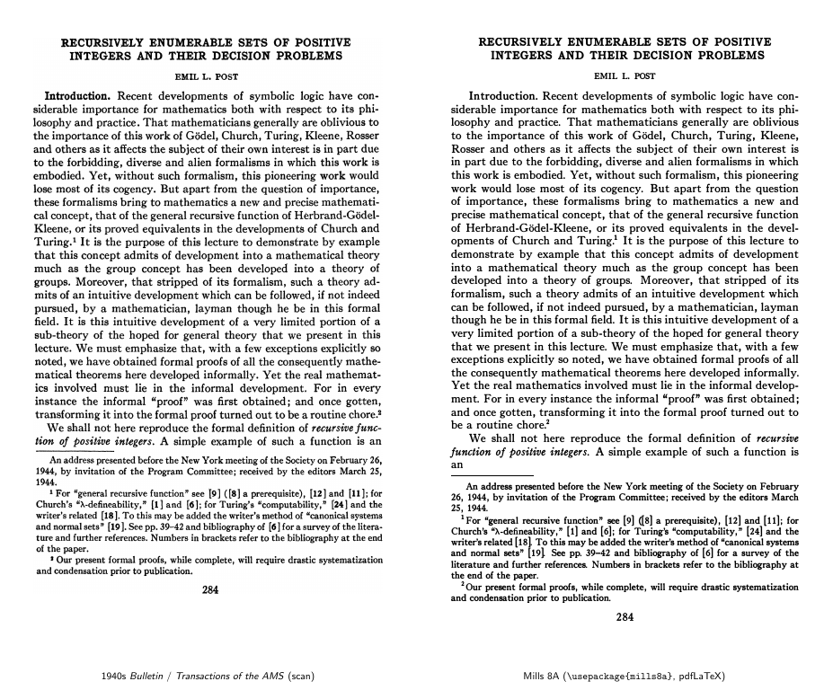
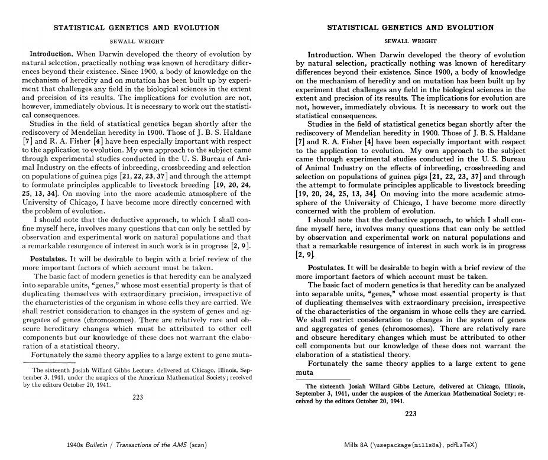
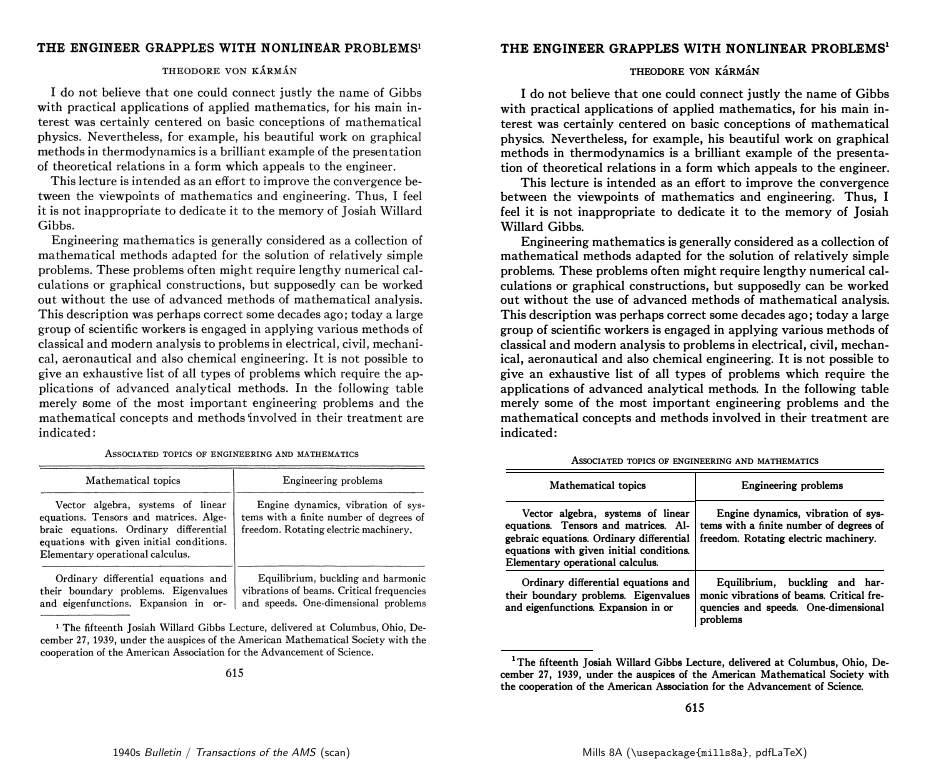

# Mills 8A

A digital revival of **Monotype Modern No. 8A**, the typeface of the
*Bulletin of the American Mathematical Society* in the 1940s, for LaTeX.
It is named after W. H. Mills, *A prime-representing function* (Bull. AMS 53,
1947), the page this project started from.



Monotype Modern 8A (Lanston Monotype's series 8, roman with italic) is a
Scotch-style "modern" face: strong contrast, ball terminals, cast in hot metal
and printed by letterpress. It was a standard face of American mathematical
printing from the 1920s to the 1960s, and it is the face Knuth modelled
Computer Modern on. Mills 8A is not a redrawing. Its glyphs are traced from the
type itself: averaged from about 900,000 letter impressions on 461 scanned
pages of the *Bulletin* and the *Transactions* (1940–1948). The shapes, the
weight of the ink, the Monotype unit widths and the real 1947 script sorts are
all as they were printed.

## The 1947 page, reset

The Mills page as printed in 1947 (left), and reset from the LaTeX source in
Mills 8A (right):



[`mills-compare.pdf`](mills-compare.pdf) has the two side by side and then
each on its own page; [`mills-8a.pdf`](mills-8a.pdf) is the page alone.

<details>
<summary>Six more first pages from the scans, reset the same way</summary>

Each reset is in `tex/pages/`, set with `tex/bulletin1947.sty`; `./compare-pages.sh` rebuilds
the images from the scans.

**P. Erdős, *Some asymptotic formulas for multiplicative functions*, Bull. Amer. Math. Soc. 53 (1947)**



**J. L. Doob, *Probability in function space*, Bull. Amer. Math. Soc. 53 (1947)**



**M. Kac, *On the notion of recurrence in discrete stochastic processes*, Bull. Amer. Math. Soc. 53 (1947)**



**E. L. Post, *Recursively enumerable sets of positive integers and their decision problems*, Bull. Amer. Math. Soc. 50 (1944)**



**S. Wright, *Statistical genetics and evolution*, Bull. Amer. Math. Soc. 48 (1942)**



**Th. von Kármán, *The engineer grapples with nonlinear problems*, Bull. Amer. Math. Soc. 46 (1940)**



</details>

## Using it

```latex
\usepackage{mills8a}            % or [osf] for old-style figures in text
```

with `revival/pdftex/tex` on `TEXINPUTS` and `revival/pdftex/fonts` on
`TFMFONTS`, `VFFONTS`, `T1FONTS`, `ENCFONTS` and `TEXFONTMAPS` (see
`render.sh`). The Bulletin set 11 pt type on 12 pt leading; `tex/mills.tex`
is a complete example, including the 1947 script positions.

It works with pdfLaTeX and standard TeX font machinery only: T1 text fonts,
OML/OMS/OMX math fonts at 11, 6.5 and 5.5 pt (so indices use the real script
sorts, as `cmmi7`/`cmmi5` do), and a virtual font that puts the 1947 big
operators into `cmex10`.

## What is in the family

| font | contents |
|---|---|
| Mills8A-Regular | roman, small caps, f-ligatures, lining and old-style figures, accents (Latin-1, Latin Extended-A) |
| Mills8A-Italic | italic, Greek, f-ligatures |
| Mills8A-Bold, -BoldItalic | bold (from the titles); bold italic (synthesized) |
| Mills8A-Regular9, -Italic9 | the 9 pt cut, for footnotes and references |
| Mills8A-Math | the 1947 letters, Greek, operators, relations, Fraktur, display ∑ ∏ ∫, and the real first- and second-order **script sorts** for indices |

### OpenType fonts

The family is also built as OpenType fonts (`revival/fonts`, with an OpenType
math font) for LuaLaTeX and other software. They can set each letter as one
of up to 8 real 1947 impressions at random (feature `rand`); `tex/mills.tex`
run with LuaLaTeX shows the setup (`fontspec`, `unicode-math`). The
difference from the pdfLaTeX page is slight.

## How it was made

1. **Segment** each 600 dpi page into glyph impressions, with Tesseract for a
   first reading and the page's lines (`revival/segment.py`, `baselines.py`).
2. **Normalize the scans**: each paper's ink weight and type size are measured
   against the Erdős paper and corrected (`docweight.py`).
3. **Cluster** identical sorts and label them (`cluster.py`, `classify.py`,
   `assign.py`). Rules do most of it; `overrides.tsv` holds the hand
   corrections, each naming one impression, so re-clustering does not
   invalidate it.
4. **Average** each sort's impressions at 4× resolution, aligned to ¼ px
   (`masters.py`). Old-style figures come from the years in the Bulletin's
   running heads (`oldstyle.py`).
5. **Trace and space** the masters into OpenType fonts (`build_font.py`). Side
   bearings are fitted from about 440,000 letter pairs in the text and land on
   Monotype's 18-unit grid. Then accents (`accents.py`), the math font on Latin
   Modern Math's tables (`build_math.py`), bold and 9 pt (`build_sizes.py`),
   and the pdfLaTeX fonts (`pdftex/build_pdftex.py`).
6. **Check**: `check_fonts.py` tests baselines, heights, side bearings and the
   script sorts of every font, and `proof/` has proof sheets of everything the
   family sets.

`revival/README.md` describes each step, the measurements behind it, and
where each glyph comes from.

## How much is real

Traced from the 1940s scans (each glyph the average of its printed
impressions):

- every roman and italic letter and figure at 11 pt, the roman J from its
  9 pt sort (66 impressions) scaled up;
- the old-style figures, from the years in the Bulletin's running heads;
- punctuation, with the 1947 quotes ‘ ’ “ ”, the question mark (10
  impressions) and the en dash (a 9 pt sort, scaled);
- 23 small capitals, 22 bold capitals and the bold hyphen;
- Greek, most math operators and relations, the display ∑ ∏ ∫, and
  Fraktur 𝔄 𝔅 ℭ 𝔇 𝔊 𝔖 𝔛;
- the 9 pt cut: 80 roman and 54 italic sorts;
- 51 script sorts for indices (46 first-order, 5 second-order).

Filled in otherwise:

- from the 1922 Lanston *Specimen Book* (No. 8A at 9–18 pt): small caps
  J Q X and `$`;
- built from 1947 sorts: the *fl*/*ffl* and italic *ffi*/*ffl* ligatures,
  the em dash, the colon and ellipsis, `\cdot` and `\cdots` (from the
  period), bold lowercase and bold italic (thickened), and the script sizes
  that have no legible real sort (the text glyph scaled: among them the
  index 2 3 4 8 and the arrow, whose real sorts fill in or were misfiled);
- from Latin Modern, thickened to the type's weight: accents other than the
  dieresis, rarer punctuation and symbols (`# % @` † ‡ ¶ « » ß Æ Œ Ø Ł
  and so on), and the math symbols the scans lack.

Spacing is measured as well: side bearings from about 440,000 letter
pairs in the text, the thin space 1947 set before `:` and `;`, and the
script positions and gaps of the Mills page. A few bearings that the
pairs cannot fix (the small-cap A before a period) are set by hand from
the scans.

## Building

The scans are not in the repository; `revival/README.md` lists them (free
from the AMS back issues). With them in `revival/scans/`:

    revival/fetch-specimen.sh     # the 1922 specimen pages (public domain)
    revival/build.sh              # about 1.5-2 h on 4 cores; clustering is most of it
    ./render.sh                   # the PDFs, proof sheets and the images above

Requires TeX Live (pdfLaTeX, `lcdf-typetools`; LuaLaTeX for the OpenType example), Tesseract, potrace,
and Python 3 with numpy, scipy, Pillow and fontTools. The built fonts are
committed in `revival/fonts/` and `revival/pdftex/fonts/`.

## Versions

Releases follow [semantic versioning](https://semver.org). The version is in
`VERSION`; the build stamps it into every font (name table and
`head.fontRevision`) and into `mills8a.sty` and its `.fd` files, and each
release is tagged `vX.Y.Z`. Until 1.0.0 glyph shapes and spacing may still
change in a minor release; patch releases change no metrics.

## Sources and licences

- The scans: *Bulletin* and *Transactions of the AMS*, 1940–1948, from the
  AMS back-issue archive; not redistributed here.
- *The Monotype Specimen Book of Type Faces*, Lanston Monotype, 1922
  (public domain).
- Latin Modern Math (GUST Font License), the base of `Mills8A-Math.otf`.
