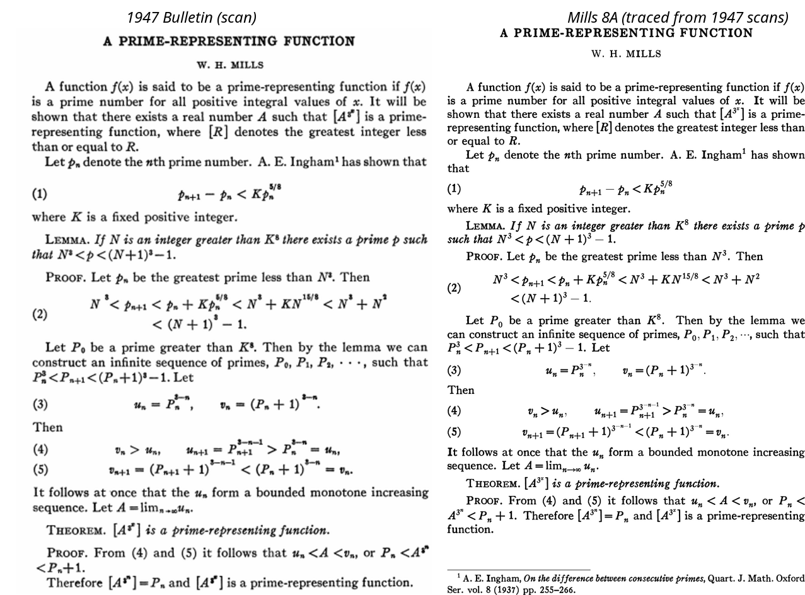

# Mills 8A: a revival of Monotype Modern 8A from 1947 scans

`fonts/Mills8A-Regular.otf` and `fonts/Mills8A-Italic.otf` are traced from
the type of the *Bulletin of the AMS*, 1947, which was 11 pt Monotype
Modern 8A on 12 pt leading. Nothing is drawn by hand: every master glyph is
the average of the copies of that sort found on the page scans.

## Sources

- `scans/erdos1947.pdf`: P. Erdős, *Some asymptotic formulas for
  multiplicative functions*, Bull. AMS 53 (1947). 9 pages.
- `scans/niven1947.pdf`: I. Niven, *A simple proof that π is irrational*,
  Bull. AMS 53 (1947). 1 page.
- `scans/lanston1922-p49.jp2`, `-p51.jp2`: *The Monotype Specimen Book of
  Type Faces*, Lanston Monotype, 1922, pp. 49 and 51, "No. 8A" at 9, 10,
  11, 12, 14 and 18 pt. Public domain; get them with `./fetch-specimen.sh`.

The two *Bulletin* PDFs are 600 dpi bilevel scans. They're not in the
repository; put copies in `scans/` under these names.

## Pipeline (`./build.sh`, ~1.5 min)

| step | what it does |
|---|---|
| `segment.py` | connected components + Tesseract hOCR → ~10,600 glyph instances with OCR guesses and line baselines |
| `baselines.py` | re-estimates each line's baseline from the letters sitting on it (display math throws Tesseract's off) |
| `cluster.py` | groups baseline-aligned instances whose shapes overlap (IoU ≥ 0.72) |
| `classify.py` | measures slant (roman/italic), stroke weight (bold) and relative size |
| `assign.py` | labels each group as (glyph, style, size): rules plus hand corrections in `overrides.tsv` |
| `masters.py` | upsamples every instance 4×, aligns to 1/4 px by FFT cross-correlation, averages (8,936 instances in 234 masters) |
| `specimen.py` | cuts the 1922 alphabets at six sizes (659 impressions) |
| `build_font.py` | potrace outlines, fits spacing, builds CFF OpenType fonts with fontTools |

## Measured facts about the 1947 type

- **Size:** 11 pt on 12 pt. The x-height is 0.40 em and the cap height
  0.61 em in the specimen; the scans add about 2 px of ink spread per edge
  at 600 dpi.
- **Spacing:** Monotype never letterspaces within a word, so the distance
  between ink edges of neighbours is P[a] + L[b]. A least-squares fit over
  about 4,300 letter pairs leaves 0.86 px RMS. The advances land on a grid
  of **4.9 px ≈ 1/18 of a 10.6–10.7 pt set** (three independent fits:
  roman, italic, small caps), which is the Monotype unit system. Lowercase
  widths come out at, e.g., e = 8, n = 10, m = 15, i = 5, w = 13 units.
- **Word space:** a median of 0.36 em ink to ink, which is 6 units (a third
  of the set) once the side bearings are subtracted.
- **The 1922 specimen** is set 11 on 12 too: matching its letters against
  the 1947 masters gives 5.89 px/pt, against 5.83 for 1 pt leading.

## What comes from where

- **1947 masters:** all roman lowercase, figures, punctuation, roman caps
  F H I J L N T, 18 small caps, italic lowercase except *j q*, italic caps
  *A B D F M N T W*, Greek *α β ζ π σ ϕ ϵ*, and + − = < > ≦ ≧ ∞ → ∑ ( ) [ ] / |,
  plus the fi and ffi ligatures.
- **1922 specimen:** the remaining capitals, small caps and italic letters.
  Each is the average of all its impressions (up to six sizes, each scaled
  by its own calibration), so a hairline broken in one impression is
  carried by the others, then thickened to the 1947 stem weight (measured
  once on *I*).
- **Built:** *ff*, from the 1947 *ffi* sort cut after the second *f*, with
  the single *f*'s arm grafted on (no *ff* occurs in the scans); its width
  is the *ffi* width less the *i* width. The en dash is a stretched hyphen.
- **By hand:** the italic *f*'s overhang (`SPACING_BY_HAND`).

## Texture and weight

- **Random impressions (`rand`).** Averaging keeps each letter's ink but
  removes the variation between impressions (fill-in, nicks, squash). So
  every sort with enough copies (132 of them) also gets four alternates
  traced from **single 1947 impressions**: typical in shape (IoU ≥ 0.8 with
  the mean) and spread from light to heavy inking. They're registered in the
  OpenType `rand` feature; with `\setmainfont{Mills8A-Regular.otf}[RawFeature=+rand]`
  luaotfload picks one per occurrence. Without `rand` you get the averaged
  master.
- **Ink (`MILLS8A_INK`, default 0.5).** The Erdős and Niven pages were
  printed a little lighter than the Mills page. Per letter, a rendered glyph
  carries the same ink as the average 1947 copy (within ~1%), but the Mills
  paragraph is ~7% darker. 0.5 scan px of extra ink per edge matches it
  (darkness ratio 0.99, same text, same scale). `MILLS8A_INK=0 ./build.sh`
  gives the type as measured.

## Not done yet

- Script sizes. The scans have 8 pt and 6 pt sorts (sizes `8`, `6` in
  `work/masters.pkl`) that could become `ssty` variants in a real OpenType
  MATH font. For now, unicode-math scales the 11 pt glyphs, which look
  lighter than the 1947 superscripts.
- Bold (titles), and the 9 pt footnote size.
- A MATH table. In LaTeX the fonts are used as `unicode-math` ranges over
  Latin Modern Math (see `tex/mills.tex`, `\useeighta`).
- Kerning, and accented letters beyond ö.
